# MCP Inspector ⚡

[](https://opensource.org/licenses/MIT)
[](https://react.dev/)
[](https://vite.dev/)
[](https://modelcontextprotocol.io/)
[](server/index.js)

**MCP Inspector** is a premium, full-featured developer visual test harness, transport bridge, and diagnostics console designed specifically for testing, debugging, and profiling **Model Context Protocol (MCP)** servers. 

Built with **React 19**, **Vite 8**, and **Node.js/Express**, it bridges the sandboxed environment of your browser with the local filesystem and remote HTTP endpoints. Whether you are debugging local command-line servers utilizing the **Stdio Transport** or remote servers running **Server-Sent Events (SSE) Transport**, MCP Inspector provides deep real-time insights, latency calculations, dynamic form renders, and full JSON-RPC packet diagnostics.

---

## 🗺️ System Architecture

MCP Inspector functions as a dual-protocol transport proxy. Since modern browsers cannot execute local command-line subprocesses directly due to strict sandboxing, MCP Inspector employs a lightweight **Node.js + WebSockets connection helper** acting as a bidirectional bridge.

```mermaid
sequenceDiagram
    autonumber
    actor Developer as 🧑‍💻 Developer
    participant UI as 🖥️ Vite UI (React 19)
    participant Backend as ⚙️ Helper Backend (Express + WS)
    participant LocalServer as 🐚 Local MCP Server (Stdio)
    participant RemoteServer as 🌐 Remote MCP Server (SSE Host)

    %% Stdio Transport Connection Flow
    rect rgb(28, 33, 48)
        Note over UI, LocalServer: Stdio Connection Protocol
        Developer->>UI: Select Stdio & Click "Connect"
        UI->>Backend: WS: "connect-stdio" { command, args, cwd, env }
        Backend->>Backend: spawn(command, args, { cwd, env })
        Backend->>LocalServer: Pipe inputs & capture stdout/stderr
        Backend-->>UI: WS: "status-change" (connected)
        UI->>Backend: WS: "send-rpc" (initialize handshake)
        Backend->>LocalServer: Pipe stdin: {"jsonrpc":"2.0","id":"init","method":"initialize",...}
        LocalServer-->>Backend: stdout: {"jsonrpc":"2.0","id":"init","result":{...}}
        Backend-->>UI: WS: "stdout-line" { isJsonRpc: true }
        Note over UI: Handshake complete! Discovering capabilities...
        UI->>Backend: WS: Batch query lists (tools/list, resources/list, prompts/list)
        Backend->>LocalServer: Pipe list queries to stdin
        LocalServer-->>Backend: stdout: returns capabilities lists
        Backend-->>UI: WS: "stdout-line" containing lists
        UI-->>Developer: Render tools, resources, and prompts sidebar
    end

    %% SSE Transport Connection Flow
    rect rgb(38, 28, 48)
        Note over UI, RemoteServer: SSE Connection Protocol
        Developer->>UI: Select SSE & Click "Connect"
        UI->>Backend: WS: "connect-sse" { url }
        Backend->>RemoteServer: HTTP GET /sse (Accept: text/event-stream)
        RemoteServer-->>Backend: Event stream chunk (event: endpoint, data: /message)
        Backend-->>UI: WS: "status-change" (connected) & map SSE endpoint
        UI->>Backend: WS: "send-rpc" (initialize handshake)
        Backend->>RemoteServer: HTTP POST /message {"jsonrpc":"2.0","id":"init",...}
        RemoteServer-->>Backend: SSE Event stream: event: message, data: {result}
        Backend-->>UI: WS: "stdout-line" { isJsonRpc: true }
        Note over UI: Handshake complete! Capabilities populated.
    end
```



---

## ✨ Features Deep-Dive

### 1. Dual Transport Protocol Support
*   **Stdio (Local Subprocesses):** Spawns and manages any CLI executable (Node.js script, Python process, Rust compiled binary, etc.). Supports passing custom arguments, setting custom working directories (CWD), and injecting local environment variables (such as custom database keys, URLs, or mode triggers).
*   **SSE (Server-Sent Events):** Launches a remote channel connection, reads and parses HTTP `text/event-stream` chunks, maps relative routing endpoints dynamically via custom `event: endpoint` tags, and proxies outgoing traffic to remote HTTP POST endpoints securely.

### 2. Auto-Generated JSON Schema Form Engine
The frontend features a fully dynamic form builder that reads the server's `inputSchema` (fully compliant with the JSON Schema standard) for Tools and Prompts, generating type-safe input controls instantly:
*   **Enums:** Rendered as clean, dropdown select components.
*   **Booleans:** Rendered as interactive checkbox toggles with automated state mapping.
*   **Numbers & Integers:** Enforce numerical constraints, custom step limits, and fallback defaults.
*   **Arrays:** Accept comma-separated entries, parsing them on-the-fly to strict JSON arrays.
*   **Strings:** Render as text inputs accompanied by field descriptions as hover tooltips.

### 3. Integrated Telemetry & Performance Metrics
*   **Latency Monitoring:** Calculates the exact execution round-trip time in milliseconds using high-resolution timers (`performance.now()`).
*   **Payload Volume Auditing:** Computes the exact network payload size of incoming answers in Kilobytes (`Blob` byte-sizing) to verify serialization overhead.
*   **Status Badging:** Instantly signals execution health with color-coded success (`teal`/`cyan`) or failure (`rose`/`red`) states.

### 4. Rich Media & Markdown Visualizer
*   **Automatic Base64 Image Detection:** Instantly detects when a tool returns binary image formats, decoding the metadata and rendering high-fidelity graphics (`PNG`, `JPEG`, `SVG`, etc.) directly inside the outputs card.
*   **Formatted Markdown:** Interprets structural text strings, list matrices, and markdown segments for robust presentation of server output content.

### 5. Diagnostics & Log Control Center
*   **JSON-RPC Packet Inspector:** A live-updating log showing all outgoing `sent` requests and incoming `received` responses, color-coded by packet types. Click any packet to expand and inspect the formatted JSON structure.
*   **Stderr Stream Terminal:** Captured output from `stderr` is rendered line-by-line, providing crucial debugging insights into local database errors, raw exceptions, `console.warn`, or print statements in real-time.
*   **Log Control Action Toggles:** Features one-click Freeze Logs to pause incoming stream visual rendering (allowing the developer to inspect a bug without stopping the active subprocess), Auto-Scroll toggles, keyword filters, and terminal clears.

---

## 🛠️ Project Directory Structure

Understanding where each module fits in the codebase:

```text
mcp-inspector/
├── .cursor/                  # Cursor IDE settings & custom instructions
├── examples/
│   └── mock_weather_server.js# Fully-featured sandbox Stdio server (Mock)
├── public/                   # Static application SVGs & assets
├── server/
│   └── index.js              # Express, WS WebSockets connection helper, & SSE transport proxy
├── src/
│   ├── assets/               # Stylings and visual design tokens
│   ├── App.css               # Main application panel styling
│   ├── App.jsx               # Core React 19 app UI layouts & protocol logic
│   ├── index.css             # Harmonious HSL color variables & layout system
│   └── main.jsx              # React 19 application bootstrapper
├── package.json              # Scripts & dependency definitions
├── vite.config.js            # Frontend bundler configuration
└── README.md                 # Project documentation (this file)
```

---

## 🚀 Getting Started

### Prerequisites
*   [Node.js](https://nodejs.org/) (v18.0.0 or higher recommended)
*   npm (Node Package Manager)

### Step 1: Install Dependencies
Clone the repository and install the project dependencies:
```bash
npm install
```

### Step 2: Start the Connection Helper (Backend Server)
The backend manages Stdio subprocess spawning and proxies Server-Sent Events. It runs on port `3001` by default:
```bash
npm run server
```
*Console output: `MCP Test Harness Backend running on http://localhost:3001`*

### Step 3: Start the Frontend UI Client
In a new terminal window, spin up the Vite development server to launch the frontend web client:
```bash
npm run dev
```
*Console output: Local URL `http://localhost:5173`*

Open **`http://localhost:5173`** in your browser to begin testing.

---

## 🧪 Interactive Testing: The Mock Weather Server

The project includes a robust **`examples/mock_weather_server.js`** file. This mock server implements the complete Model Context Protocol spec (Stdio transport) and serves as an excellent sandbox to explore all features of the inspector.

### 1. Connection Configurations Setup
1. In the **Connection Settings** sidebar (left panel), choose **Stdio (Local)**.
2. Configure the following parameters:
    *   **Command:** `node`
    *   **Arguments:** `examples/mock_weather_server.js`
    *   **Working Directory:** *(Leave empty)*
    *   **Environment Variables:** `NODE_ENV=development`
3. Click **Start Server / Connect**.

Upon successful handshake, the header status turns **CONNECTED** showing `mock-weather-server@1.0.0`, and the capabilities sidebar is populated.

---

### 2. Available Capability Tests

#### 💼 Tool Execution Tests

| Tool Name | Arguments | Description & Sandbox Behavior |
| :--- | :--- | :--- |
| **`get_weather`** | `city` (string, required)<br>`unit` (enum: celsius, fahrenheit) | Returns random weather forecasts. Verifies **dynamic enum dropdown select forms** and response content mapping. |
| **`calculate_sum`** | `a` (number, required)<br>`b` (number, required) | Performs simple additions. Simulates **800ms computation delay** to showcase latency tracking, and prints diagnostic messages to `stderr` to showcase terminal routing. |

#### 📂 Resource Fetching Tests

*   **`Severe Weather Alerts` (`file://weather/alerts.txt`):** Reads a mock severe weather log file. Use this to verify text/plain MIME type handling and JSON-RPC `resources/read` structures.

#### 💬 Prompt Template Tests

*   **`summarize_weather`:** Accepts arguments `city` (string, required) and `mood` (enum: friendly, dramatic, professional). Generates pre-formatted system & user message matrices designed to be passed directly to LLM endpoints.

---

## ⚙️ Technical deep dive

### 1. Process Multiplexing & Handshake (Stdio)
When starting a local server, the backend spawns a child process:
```javascript
activeProcess = spawn(command, args, { cwd, env, shell: true });
```
It utilizes Node's `readline` interface to listen to `stdout` line-by-line:
```javascript
activeProcessInterface = readline.createInterface({
  input: activeProcess.stdout,
  terminal: false
});
```
Every incoming line is evaluated. If it contains a valid JSON-RPC 2.0 packet (e.g., `jsonrpc: "2.0"`), it is parsed and forwarded to the frontend WebSocket connection as `stdout-line` with `isJsonRpc: true`. Raw text printed to stdout or stderr is formatted as raw terminal feeds.

The React client initiates the Model Context Protocol handshake sequence immediately upon connection:
```json
{
  "jsonrpc": "2.0",
  "id": "init-handshake",
  "method": "initialize",
  "params": {
    "protocolVersion": "2024-11-05",
    "capabilities": { "tools": {}, "resources": {}, "prompts": {} },
    "clientInfo": { "name": "mcp-test-harness", "version": "1.0.0" }
  }
}
```
Upon receiving a successful handshake response, the frontend sends a `notifications/initialized` notification and triggers asynchronous batch list requests (`tools/list`, `resources/list`, and `prompts/list`) to populate the interface.

### 2. Server-Sent Events (SSE) Proxy Connection
For remote SSE servers, the backend handles connections via native `fetch` stream readers:
```javascript
const response = await fetch(url, { headers: { Accept: 'text/event-stream' } });
const reader = response.body.getReader();
```
The incoming binary buffer stream is dynamically decoded in a non-blocking loop using `TextDecoder`. The proxy parses SSE syntax:
*   **`event: endpoint`:** Captures the data payload representing the HTTP POST destination mapping. The backend resolves relative paths against the root SSE URL and maps it as the active remote message delivery endpoint (`sseMessageUrl`).
*   **`event: message`:** Parses incoming data chunks as JSON-RPC packets, forwarding them to the frontend logs console.

Outgoing messages from the client are routed via HTTP POST requests to the resolved `sseMessageUrl` endpoint.

---

## 🎨 Palette Design System (HSL System)

MCP Inspector employs a premium, high-contrast, yet readable dark-mode palette utilizing CSS custom properties for cohesive components styling:

*   **Space Background:** `hsl(222, 25%, 10%)` (Deep slate background reducing eye-strain)
*   **Control Panels:** `hsl(222, 20%, 14%)` (Clean visual elevations)
*   **Active Accents:** `hsl(180, 100%, 50%)` (Vibrant cyan representing connected states)
*   **Stdio Accents:** `hsl(270, 90%, 65%)` (Sleek purple signaling subprocess bounds)
*   **Warnings & Errors:** `hsl(350, 85%, 60%)` (Bright coral-red representing exits/exceptions)

---

## 📄 License

This project is licensed under the MIT License - see the [LICENSE](LICENSE) file for details.
